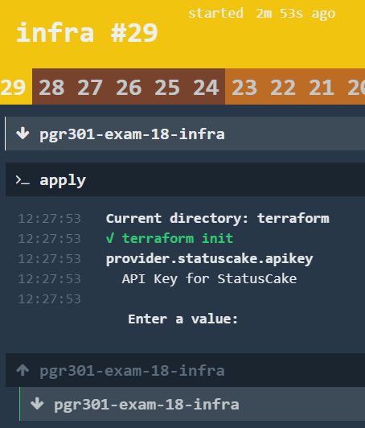

# pgr301-exam-18-infra

Exam repository for PGR301 at Westerdals OSLO ACT/Høyskolen Kristiania, Fall 2018 by candidate number: 100018

1. [  Instructions ](#Instructions)
2. [ Attempted Features ](#AttemptedFeatures)
3. [ Reflections ](#Reflections)
4. [ References ](#References)
5. [ Future Changes ](#FutureChanges)

## 1. Instructions

Note: These instructions are not meant to replace the examinators instructions or run though. They are for future usage 
in case someone with little or no experience want to try for themselves.

##### Set up infrastructure:
1. Replace the names and URIs the project. For simplicity, all name/URI variables have been tagged with "TODO", 
which will automatically pop up in the tab named "TODO" in the bottom of IntelliJ.
2. Replace Heroku variables (optional).

##### Run the pipeline:
1. Complete instructions above.
2. Start Docker
3. Navigate to the infra project in a terminal (Git Bash for example).
4. $ docker-compose up -d
5. $ fly --target tar login --concourse-url http://127.0.0.1:8080
6. $ fly -t tar sp  -p exam-100018 -c concourse/pipeline.yml -l credentials.yml
7. In you browser, go to [http://127.0.0.1:8080/teams/main/pipelines/exam-100018](http://127.0.0.1:8080/teams/main/pipelines/exam-100018)
8. Click "login"
9. In the hamburger menu in the top left, press the play-icon next to "exam-100018".
10. If the pipelines does not start automatically, go to "infra" and click the "+" button in the top right.

##### Hosted Graphite:
1. Go to [Hosted Graphite](https://www.hostedgraphite.com/) and make a profile (or link Heroku profile if you have one)
2. Add the addon to a project.
3. Get the API key and host URL from the "Overview" tab on the left. Host URL can be found when you click "How do I send metrics?"
under the API key. the URL looks like this "x.carbon.hostedgraphite.com" where "x" is a 8 char value. 
Links to these fields can be found under the "TODO" tab in IntelliJ.
4. In the App, add the values in the fields in getReporter method in GraphiteMetricsConfig.
5. Run the app, do some API calls.
6. Go back to [Hosted Graphites metrics page](https://www.hostedgraphite.com/app/metrics/) Search for "100018" 
(or whatever you may have changed it to) in sendReportTcp method.
7. View the metrics.

##### Testing:
1. Stop any running applications that run on port 8080
2. Run Application
3. Run tests

##### Run the app manually:
1. Stop any running applications that run on port 8080
2. Run the Application class
3. Go to one of the endpoints listed below

 - [add-item, item=Go skydiving](http://localhost:8080/add-item?item=Go-skydiving)
 - [get-list](http://localhost:8080/get-list)
 - [get-item, id=1](http://localhost:8080/get-item?id=1)
 - [update-item, id=1, item=Dance all the Fortnite dances](http://localhost:8080/update-item?id=1&item=Dance-all-the-Fortnite-dances)
 - [delete-item, id=1](http://localhost:8080/delete-item?id=1)
 - [delete-all](http://localhost:8080/delete-all)

## 2. Attempted Features

 - Basis pipeline
 - Overvåkning, varsling og Metrics 

## 3. Reflections

In case there is any questions to the usernames used to commit on GitHub: 
I, the candidate 100018, is the only human that has committed anything to the repositories. The Concourse bot has of course committed too, but this is expected.
I have used two computers (home- and school computer), with different display names because I thought it would simplify the overview. 
I noticed recently that it makes less sense with aliases because they don't directly link back to the profile of the user which can look very suspicious. 
All contributors should appear under "Insights/Contributors", though, even if the Concourse bot does not appear there. 
Otherwise, running the "git log | grep Author: | sort | uniq" in the commandline in the repo folder shows that at least one of the candidate aliases has the same email.
Nonetheless, I understand if this looks fishy, so I choose to highlight it and my confidence in it being resolved.

##### On the app:
I didn't expect to made an API for this exam so It caught me off guard and delayed the plans I had. 
Anyways, since we've had other courses where we make APIs this semester I had some code I could lean on to fast track the development. 
Since the other courses don't use Java I didn't actually use any code, just looked at the structure. 
I did, however find a lot of guides on the internet I did draw inspiration and a few snippets of code from. 
The links to these sites are of course listed under [References](#References)
I also had to do some things to jerryrig the app together, that aren't in line with what we've been though is good code practise. 
One example is that I used a test method to clear the data in the map (IMDB) in the @Before method. 
Ideally you shouldn't rely on tests or network methods to perform utility operations like resetting variables or databases, but with API you sort of have to.
Some of the test where the appropriate status code would be "201 created" results in an error, will fail since the status code is 200. 
This is due to poor implementation of the API. Luckily though, the API is not the focus in the exam.

##### Infra:

The infra-part of the project started off pretty good. I was confident because the assignment sounded similar to the 
exercises that was assigned in class. This soon turned around when it came to testing the pipeline. 
First off I had some issues because I put the name of the infra-repository in one of the fields which should have the 
name of the app-repository. The small error was simple to fix, though it took some time before I found where the error was.
The second issue was much, much worse. concourse/terraform/task.yml, the file runs the shellscript "terraform.sh". 
For a while the error messages fluxed between "file not found" and "permission denied". 
"File not found" is self explaining, but lack of experience with containers and how they ran made it slightly more 
difficult. In the end, with trial an error, as well as looking at some examples from the provided exam repository. 
"Permission denied" was much worse to figure out. Scouring the internet I found a few people with similar issues, 
but none of them had the same setup with concourse and docker. Again, using trial end error, 
with close to 50 attempts and a lot of pushing to GitHub (commits with "pathtest", "test" or simply a number can be 
ignored, mostly pushed for figuring this problem out) I found a was to run the script. 
I still don't know why the file was denied permission, but I tried various ways of setting file read/write/executables, 
but ended up running the file though the terminal in the image (I think). 

To make matters worse the internet was cut for 2 and a half days so I had limited access though shared wifi though my phone.
Once it seemed like the pipeline found the fine and could execute it, the pipeline halted, 
prompting me for an API key for Statuscake. Simply removing anything that had to do with Statuscake fixed this, 
even though I had the key in my credentials-file (correct key name and value).

In the later parts of getting the Basic Pipeline requirement to work, 
I wasn't entirely sure what the last bullet point under Application was supposed to mean.
The text reads: "Should any of the tests fail, the build should fail", where the of "tests" is clear, 
referring to unit-tests in the bullet point above, however, what "build" isn't entirely clear. I originally thought 
it meant the pipeline build,
but after some attempts trying to get it to work I'm grew more uncertain. I don't recall going though this is class. 
The only references to testing I could find in the course assignments was in the course 9 assignments, being part of a 
Docker run-command, building an application with no unit tests (example app from lessons 7 and 8).
Due to this, and the context of the bullet point being under the application header, I assume this means that the Maven 
(mentioned in a bullet point above) build on the machine should fail, not the pipeline. 

All in all I think I did an OK job. Considering the setbacks and problems I had I would say I did a slightly-better-than-ok
job. I didn't really expect to have that many setbacks, but I guess that's on me. As I'm sure the lecturer is aware of, 
there are many components that can go wrong with pipelines, and setting them up for others to run on their computers can 
lead to a lot of confusion. With this in mind I wrote the instructions after how I run the pipeline, tests, and so on,
and hope for the best. I hope I explained most of my problem solving and what I understood the text in the assignment to mean,
and that that can be incorporated in the next exam text.

##### Additional Features:

Now that the project fulfils the requirement to "Basic Pipeline" I can work on feature to raise the grade.
Considering it is only a few days to delivery, I'm probably limited to one, and in that case I choose the 
"Surveillance, warning, and metrics". It was a bit difficult getting started, not being used to the add-on, 
or even using add-ons on pipelines. I'm not entirely sure if I had the right idea, 
but I'm sure I'm on the right track. One interesting incident with the website of hosted graphite, 
is that it seems like I broke the CSS, 
with a big portion of the page displaying a pop-up guide to adding data that I can't remove. 
The mouse also click the wrong element, fault in the Y-axis.
By now I have managed to send data to HostedGraphite though TCP, which I'm not sure is what is the way it was 
intended to be sent according to the assignment.
Since Hosted Graphite provided a webpage with remote metrics and "graphite host"-value which looks like a URL, 
I assumed part of the assignment was to report to this page. Now going forward I'm not entirely sure, but since I
already have the TCP code that send a string I might as well keep it for bonus points.

I chose to implement meters, a counter, and a timer.
 - Meters: All API calls will effect the meter. This will record the total number of calls to the API, 
 along with calls per second. Very useful for tracking load and when one should increase number of servers though for example AWS.
    - See methods: all API methods.
 - Counter: Simply counts how many items are currently in the list. Adding items increments, deleting decrements or removes all items.
    - See methods: addItem (increments counter), deleteItem (decrements item if item can be deleted), 
    deleteAll (decrements with current value of counter (set counter to 0))
 - Timer: Records the time it takes to retrieve all data. Useful to know when one should prune the database or 
 implement pagination or similar buffering measures.
    - See methods: getList (records the total time the whole method takes)
    
I realized I had mistaken some of the instructions, and going back to them simplified things a bit. 
It seems to be working, sending data over TCP, though I went over the number of metrics I was allowed. 

## 4. References

##### App references:

General pointers to make API from [Spring](https://spring.io/guides/gs/rest-service/)

setup method in BucketlistApiTest, from [Semaphoreci](https://semaphoreci.com/community/tutorials/testing-rest-endpoints-using-rest-assured)

## 5. Future Changes

Once the grade for this exam is received, I will let 2 weeks to pass, in case there are some reason mine was graded 
early or there are other students with extended time who are still working on their projects, before I transfer these
repositories to my main GitHub Account and delete the temporary anonymous exam account. 
For this reason, there might be changes in URLs, reference-paths, or owner/collaborators in the coming months.